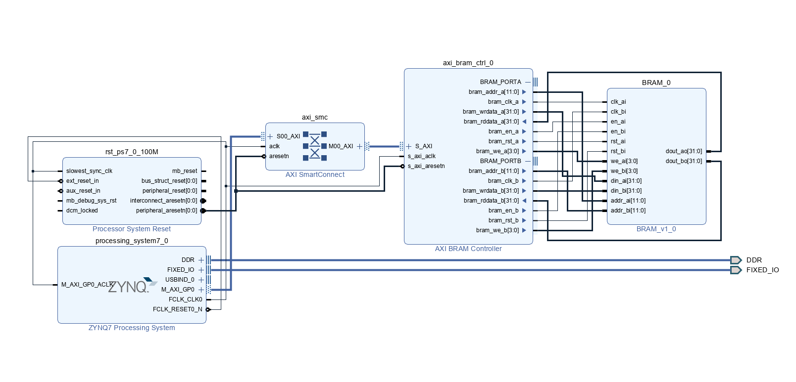

# FPGA-BRAM

> 2022 Spring NCKU FPGA Course
>
> Homework 4
>
> E24076239 E24076297 E24076750

## Problem 1

Use the AXI bus to combine the ZYNQ processor and AXI BRAM controller, and the BRAM controller is connected to our BRAM IP. 

* Specification of BRAM(RAMB36E1):
  * Memory size: 32Kb(4KB)
  * Memory depth: 1024
* Configuration of our BRAM IP:

    | Param          | Setting |
    | -------------- | ------- |
    | `RAM_MODE`	| `"TDP"` |
    | `READ_WIDTH_A` | `36`    |
    | `READ_WIDTH_B` | `36`    |
    | `WRITE_WIDTH_A` | `36`    |
    | `WRITE_WIDTH_B` | `36`    |
    | `WRITE_MODE_A` | `"TDP"` |
    | `WRITE_MODE_B` | `"TDP"` |

## Problem

1. How much capacitance of block RAM does **PYNQ-Z2** have?

   Answer: **630KB**

2. Continuing from the previous question, how many **RAMB36E1**s are there in total?

   Answer: Each RAMB36E1 has a capacity of 36Kb, the number of RAMB36E1 on PYNQ-Z2 is **(630KB / 36Kb) = 140**. 

3. To configure RAMB36E1 into 36Kb FIFO, what Verilog Template should be used?

   Answer: 

   | Params | Setting | Description |
   | ------ | -----|------ |
   | `DOA_REG`&`DOB_REG` | `0` | Default value |
   | `INITP_00` to `INITP_0F` | all zero | Default value |
   | `INIT_00` to `INIT_7F` | all zero | Default value |
   | `INIT_A` & `INIT_B` | all zero | Set the initial output zero |
   | `INIT_FILE` | `"NONE"` | Unused here |
   | `RAM_MODE` | `"SDP"` | Use simple dual port mode to write and read data separately in FIFO.  Port A: read port Port B: write port |
   |`READ_WIDTH_A`| `72` | Use maximum input width of `DIADI` ,`DIBDI`,  `DIPADIP`, and `DIPBDIP` |
   |`READ_WIDTH_B`|`0`|Read port of B is unused|
   | `WRITE_WIDTH_A` | `0` |Write port of A is unused|
   |`WRITH_WIDTH_B`|`72`|Use maximum output width of  `DOADO` ,`DOBDO`,  `DOPADOP`, and `DOPBDOP`|
   | `WRITE_MODE_A` | `"WRITE_FIRST"` |Since each port has its own clock in FIFO, the write first mode is preferred|
   |`WRITE_MODE_B`|`"WRITE_FIRST"`|Same as above|

   | Port    | Direction | Description                           |
   | ------- | --------- | ------------------------------------- |
   | `DIADI` | input     | The logical `DO<31:0>` |
   | `DIBDI` | input | The logical `DO<63:32>` |
   | `DIPADIP` & `DIPBDIP` | input | Parity bits of input data |
   |`ADDRARDADDR<15:0>`|input|Read address input bus|
   |`ADDRBWRADDR<15:0>`|input|Write address input bus|
   |`CLKARDCLK`|input|Read clock input|
   |`CLKBWRCLK`|input|Write clock input|
   |`ENARDEN`|input|Read enable, pulling high when the FIFO is not "empty" or "almost empty"|
   |`ENBWREN`|input|Write enable, pulling high when the FIFO is not "full" or "almost full"|
   | `DOADO<31:0>`         | output    | Data output bus addressed by `RDADDR`, the logical `DO<31:0>` |
   |`DOBDO<31:0>`|output|Data output bus addressed by `RDADDR`, the logical `DO<63:32>`|

